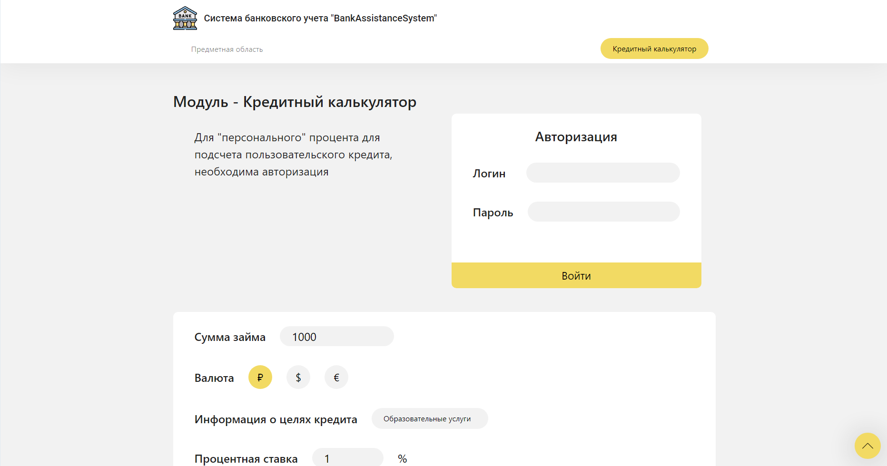

# Репозиторий проекта BankAssistanceSystem

## Технологии Приложения:
* MS .NET 5 Core
* WPF (MVVM)
* Entity Framework Core 6

## Технологии Сайта:
* MS .NET 5 Core
* ASP.NET (MVC)
* Entity Framework Core 6

## База данных:
* MS SQL
* Файл с базой данной расположен в "src/shared/DataBase"
* Необходимо подключить на сервер - (localdb)\MSSQLLocalDB или же сменить путь подключения в:
    * Для Приложения "src/bas.program.prj/Models/BankDbContext.cs", поле "_connectionString"
    * Для Сайта "src/bas.website.prj/appsettings.Project.json", поле "Connection"

### Сриншоты Приложения:

### Сриншоты Сайта:

")
